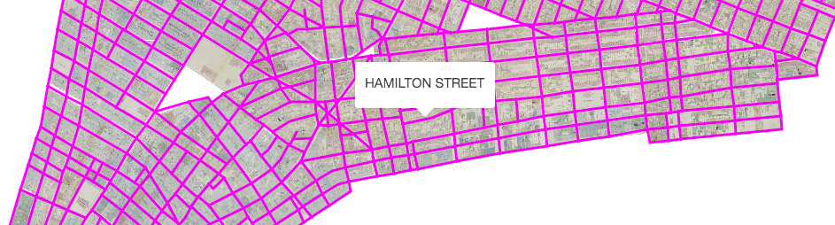

# NYC Historical Streets

This repository contains [shapefiles](https://en.wikipedia.org/wiki/Shapefile) with street centerlines, traced with [QGIS](http://www.qgis.org/), from a selection of historical map layers of New York City from NYPL’s [Map Warper](http://maps.nypl.org/warper/).

The shapefiles from this repository are used by various parts of the [NYC Space/Time Directory](http://spacetime.nypl.org) project.

__Note: if you're interested in only using the data in this repository (instead of also editing and improving the Shapefiles), it might be easier to use the data published on the website of the [NYC Space/Time Directory](http://spacetime.nypl.org/#data-nyc-streets).__

## Coverage Map

To see which parts of New York City are covered by the shapefiles in this repository, please [see this map](http://geojson.io/#data=data:text/x-url,http%3A%2F%2Fs3.amazonaws.com%2Fspacetime-nypl-org%2Fdatasets%2Fnyc-streets%2Fnyc-streets.geojson
).

## Contributing

You can contribute by tracing streets from one of the unfinished layers in the [table below](#status), or by adding a [new layer from Map Warper](http://maps.nypl.org/warper/layers/). [A detailed tutorial is available](https://github.com/nypl-spacetime/qgis-trace-tutorial) on how to use QGIS to trace historical maps from Map Warper.

To contribute, [fork this repository](https://guides.github.com/activities/forking/), and make a pull request when you're finished. If you’re adding a new layer, don’t forget to also add the layer to  [`layers.json`](layers.json).

## Status

| Layer           | Status          | Map Warper
|:----------------|:----------------|:---------------
| [`859`](859)    | ✅              | [Manhattan - Maps of the city of New York, 1857](http://maps.nypl.org/warper/layers/859)
| [`860`](860)    | ✅              | [Brooklyn - Maps of the city of Brooklyn, 1855](http://maps.nypl.org/warper/layers/860)
| [`867`](867)    | __In progress__ | [Brooklyn - Robinson's atlas of the city of Brooklyn, 1886](http://maps.nypl.org/warper/layers/867)
| [`1046`](1046)  | __In progress__ | [Queens - Atlas of the borough of Queens, 1912](http://maps.nypl.org/warper/layers/1046)
| [`1138`](1138)  | __In progress__ | [Manhattan - Atlas 107. Vol. 1, 1894](http://maps.nypl.org/warper/layers/1138)
| [`1142`](1142)  | ✅              | [Manhattan - Atlas 110. Vol. 2, 1903](http://maps.nypl.org/warper/layers/1142)
| [`1162`](1162)  | ✅              | [Queens - Atlas 134. Vol. 2, 1915](http://maps.nypl.org/warper/layers/1162)
| [`1035`](1035)  | __In progress__ | [Staten Island - Atlas of the city of New York, borough of Richmond (1917)](http://maps.nypl.org/warper/layers/1035)
| [`883`](883)    | __In progress__ | [The Bronx - Atlas of borough of the Bronx (1921)](http://maps.nypl.org/warper/layers/883)
| [`1157`](1157)  | __In progress__ | [Manhattan, Washington Heights - Atlas 42.61. Vol. 11-11 1/2 (1893)](http://maps.nypl.org/warper/layers/1157)

## See Also

- Mauricio Giraldo’s [animation of tracing historical streets](http://mgiraldo.github.io/centerlines/)
